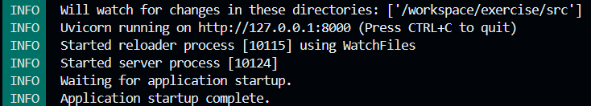

## Setup
In de terminal onderin het scherm moet je het volgende zien:
`@username -> /workspace/exercise/src` 
Als je in een andere folder zit ga naar deze folder.

## De app draaien
Run de volgende command in de terminal:
`$ uv run fastapi dev`
Na een tijdje moet je output er zo uitzien:

Als je hierin met ctrl ingedrukt op de `http://17.0.0.1:8000` drukt open je de app.

Door de URL waar je naar toegestuurd wordt te appenden met `/docs` (let erop, geen extra `/` op het einde!) kan je de Swagger UI zien, met daarin alle API endpoints uitgelegd.